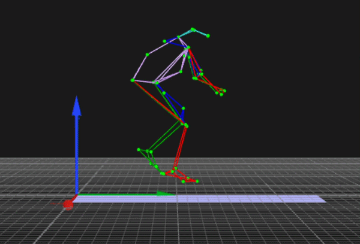
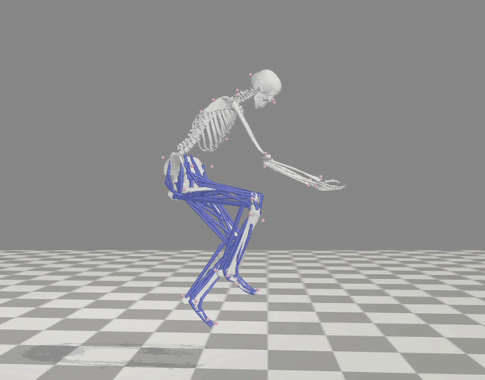
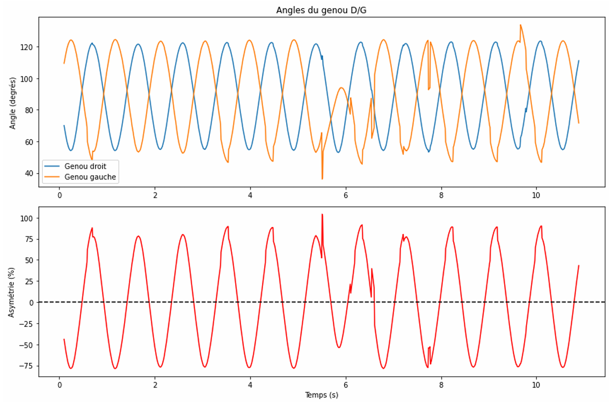
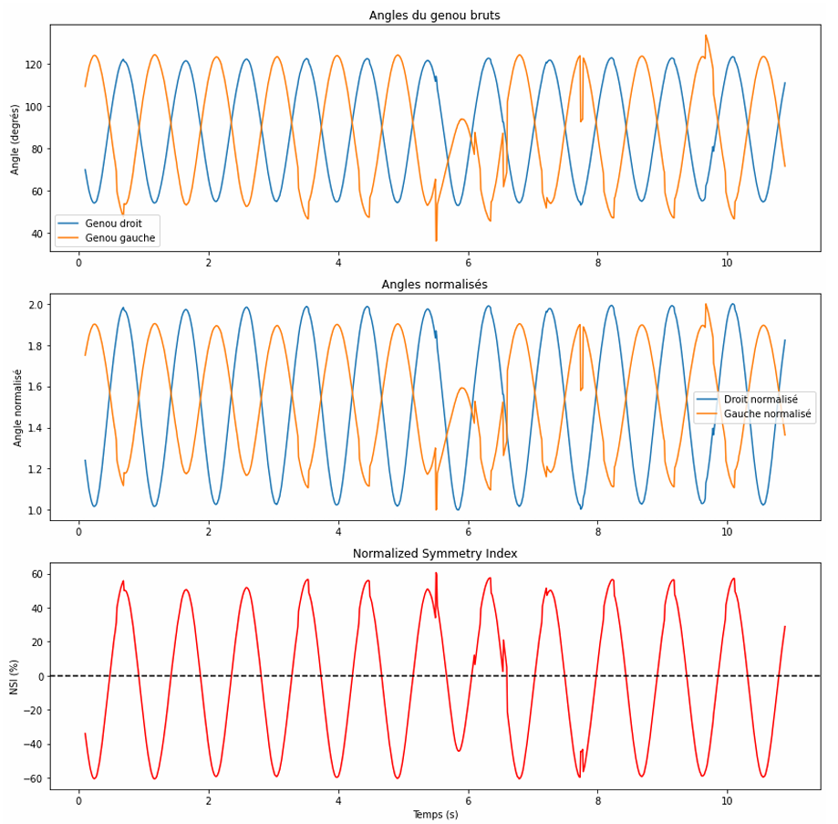

# Sports Movement Asymmetry Analysis

[](https://www.python.org/)
[](https://www.qualisys.com/)
[](https://opensim.stanford.edu/)
[](https://scipy.org/)

> Complete pipeline for assessing bilateral movement asymmetries using motion capture, inverse kinematics, and custom data processing. Demonstrates practical workflow from capture to biomechanical interpretation.

**Status:** Master's research project (2024-2025) | **Subject:** 1 competitive athlete | **Trials:** 37  
**Key finding:** Cross-correlation r = 0.957 (bilateral knee synchronization)

---

## Visualization

### Capture → Kinematics Workflow

 


*Left: Raw 3D marker trajectories (Qualisys). Right: Computed joint angles (OpenSim).*

---

## Results

### Bilateral Synchronization

**Cross-correlation analysis (knee angles):**
- **r = 0.957** — strong bilateral similarity
- **lag = 0 frames** — perfect temporal alignment

Indicates excellent bilateral coordination despite small amplitude asymmetries.

### Asymmetry Index Instability & Solution


*Left: Relative Asymmetry Index (SI) shows mathematical instability in cyclic movements, oscillating between -75% and +100%.*


*Right: Normalized Symmetry Index (NSI) stabilizes values to -60% to +60%, enabling reliable cycle-by-cycle analysis.*

### Range of Motion Across Movements


*Example: ROM during vertical jumps. Complete ROM analysis for all conditions (SJ, CMJ, walking, running at 2 speeds, cycling at 2 cadences) in `results/` folder.*

---

## Data Pipeline
```
Raw capture (.c3d)  →  [Python preprocessing]  →  3D trajectories (.trc)
                  ↓
          [OpenSim IK]  →  Joint angles  →  Asymmetry analysis
```

**Movements:** Vertical jumps (SJ, CMJ) | Walking | Running (2 speeds) | Cycling (2 cadences)

---

## Scripts

### `c3d_to_trc.py` — Qualisys to OpenSim Conversion
- Converts .c3d → .trc format
- Applies reference frame transformation (calibration-based rotation matrix)
- Batch processes 37 trials automatically
- Handles missing markers via interpolation

**Usage:**
```bash
python c3d_to_trc.py --batch 1 37  # Process all trials
python c3d_to_trc.py --input trial0001 --output trial0001_fixed.trc  # Single trial
```

### `c3d_to_mot.py` — Force Plate Data Extraction
- Extracts GRF data from .c3d files
- 4th-order Butterworth filtering (6 Hz cutoff)
- Converts moments N·mm → N·m
- Generates OpenSim-compatible XML

**Usage:**
```bash
python c3d_to_mot.py --batch 1 37  # Batch processing
python c3d_to_mot.py --input trial0001 --output trial0001_GRF.xml
```

**Both scripts include:**
- Professional logging (error tracking, progress monitoring)
- Type hints and complete docstrings
- CLI arguments for flexibility
- Robust error handling

---

## Tech Stack

| Category | Tools |
|----------|-------|
| Motion Capture | Qualisys (16 cameras, optoelectronic) |
| Preprocessing | Python 3.12 + ezc3d + scipy |
| Biomechanics | OpenSim (scaling, IK, inverse dynamics) |
| Force Analysis | AMTI + Kistler force plates (1000 Hz) |
| Visualization | Matplotlib, Qualisys Track Manager |

---

## Methodology

### Capture Protocol
- **Subject:** Competitive handball player, 80 kg
- **Marker set:** 49 full-body markers (M2S model) + 5 custom markers
- **Frame rate:** 120 Hz (motion capture), 1000 Hz (force plates)
- **Trials:** 37 validated (2 rejected: marker loss)

### Data Processing Workflow

1. **Qualisys Track Manager (QTM)**
   - Manual labeling (trial 1) → Automatic template labeling (trials 2-37)
   - Polynomial + relational interpolation for missing markers
   - Export to .c3d format

2. **Python Preprocessing Pipeline**
   - Load .c3d, extract 3D coordinates
   - Apply calibration-based rotation matrix
   - Generate .trc (kinematics) + GRF XML (dynamics)
   - Batch process with error handling

3. **OpenSim Analysis**
   - Scale musculoskeletal model to subject (80 kg, anthropometry)
   - Inverse kinematics: 3D marker positions → joint angles
   - Inverse dynamics: angles + GRF → joint torques

### Asymmetry Quantification Methods

Evaluated 4 metrics for left-right comparison:

| Method | Use case | Advantage | Limitation |
|--------|----------|-----------|-----------|
| **ROM** | Static/discrete movements | Simple, interpretable | No temporal detail |
| **Asymmetry Index (SI)** | Overall comparison | Standard in literature | Mathematically unstable (small denominators) |
| **Normalized SI (NSI)** | Cyclic movements | Controlled range | Somewhat arbitrary normalization |
| **Cross-correlation** | Cycle similarity | Holistic, phase-aware | Misses specific phase asymmetries |

**Finding:** For cyclic movements (running, cycling), cross-correlation (r = 0.957) most robust. SI generates spurious values when R ≈ L.

---

## Limitations

- Single subject proof-of-concept (small sample size)
- No ground-truth validation against marker-based gold standard
- SI metric unsuitable for cyclic analysis (mathematical singularities)
- Force plate analysis not extensively explored in this analysis

---

## Academic Reference

> Birba, J., Giot, B., Le Gall, M. (2024). Emerging technologies and methods for assessing asymmetry during sports movements. Master 2, Digital Sciences and Sports (EUR Digisport), Université Rennes 2.

---

## Technical Note

Motion capture data processed using M2S Laboratory musculoskeletal model (Université Rennes 2). Model files proprietary to M2S Lab. Full implementation code available for preprocessing pipeline; Qualisys Track Manager and OpenSim required for reproduction.

---

*Jérémy Birba — [LinkedIn](https://linkedin.com/in/birba-jeremy) | [GitHub](https://github.com/JeremyDataHub)*
