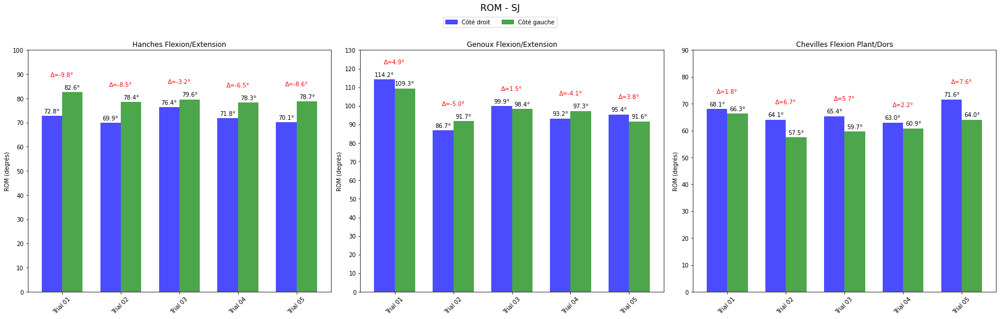

# Sports Movement Asymmetry Analysis

Biomechanical assessment of bilateral asymmetries across 5 movement types using 
motion capture, inverse kinematics, and custom data processing pipelines.

**Status:** Master's research project (2024-2025)  
**Subject:** 1 competitive handball player | **Trials:** 37  
**Result:** Cross-correlation r = 0.957 (bilateral knee angle symmetry)

## Visualization

### Motion Capture → Kinematics

 


*Left: Raw 3D marker trajectories (Qualisys). Right: Computed joint angles (OpenSim).*

---

## Overview

This project investigates functional and biomechanical asymmetries in sports movements 
using a complete motion capture → analysis pipeline:
```
Raw motion capture (.c3d)
    ↓
[Python preprocessing]
    ↓
3D marker trajectories (.trc)
    ↓
[OpenSim inverse kinematics]
    ↓
3D joint angles + inverse dynamics
    ↓
Asymmetry analysis (ROM, SI, NSI, cross-correlation)
```

**Movements studied:**
- Vertical jumps (SJ, CMJ)
- Walking
- Running (2 speeds: moderate, fast)
- Cycling (2 cadences: moderate, fast)

---

## Key Technical Contributions

### 1. Qualisys ↔ OpenSim Pipeline

**Problem:** .c3d files require extensive manual preprocessing before OpenSim compatibility.

**Solution:** Two automated Python scripts:

**`c3d_to_trc_transformed.py`** (47 lines)
- Converts Qualisys .c3d → OpenSim-compatible .trc
- Applies rotation matrix transformation (reference frame alignment)
- Batch processes 37 trials automatically
- Resolves Y-Z axis swap issue

**`c3d_en_mot.py`** (103 lines)
- Extracts force plate data from .c3d files
- 4th-order Butterworth low-pass filtering (6 Hz cutoff)
- Converts moments from N·mm → N·m
- Generates OpenSim-compatible GRF XML files

**Impact:** 10x faster than manual preprocessing + reproducible workflows

### 2. Asymmetry Analysis Methods

Compared 4 approaches to quantify left-right differences:

| Method | When to use | Strength | Weakness |
|--------|-----------|----------|----------|
| **ROM** | Quick assessment | Simple interpretation | No temporal detail |
| **Asymmetry Index (SI)** | Static movements | Standard metric | Unstable with small denominators |
| **Normalized SI (NSI)** | Cyclic movements | Controlled range | Still somewhat arbitrary |
| **Cross-correlation** | Cycle similarity | Holistic view + temporal alignment | Misses specific phase asymmetries |

**Finding:** For cyclic movements (running, cycling), cross-correlation (r = 0.957) 
was most reliable. SI generated spurious values (-75% to +100%) due to mathematical 
instability when right ≈ left values.

---

## Results

### ROM Asymmetries Across Movements




### Asymmetry Index Comparison


### Bilateral Synchronization


**Key result:** Knee angle cross-correlation r = 0.957 with lag = 0, indicating 
perfect bilateral temporal alignment despite small amplitude variations.

---

## Technical Stack

| Component | Tool | Purpose |
|-----------|------|---------|
| **Motion Capture** | Qualisys (16 cameras, optoelectronic) | 3D marker trajectories |
| **Data Processing** | Python 3.12 + ezc3d + scipy | .c3d conversion, filtering |
| **Biomechanics** | OpenSim | Scaling, IK, inverse dynamics |
| **Force Analysis** | AMTI + Kistler force plates | Ground reaction forces |
| **Visualization** | Matplotlib, Qualisys Track Manager | Results & diagnostics |

---

## Methodology

### Capture Protocol

- **Subject:** Competitive handball player, 80 kg, male
- **Marker set:** 49 full-body markers (M2S lab model) + 5 custom markers
- **Frame rate:** 120 Hz (motion capture), 1000 Hz (force plates)
- **Trials:** 37 validated captures (2 rejected due to marker loss)

### Data Processing Pipeline

1. **Qualisys Track Manager (QTM)**
   - Manual marker labeling on first trial
   - Automatic template-based labeling for subsequent trials
   - Polynomial + relational interpolation for missing markers
   - Export to .c3d format

2. **Python Preprocessing** (custom scripts)
   - Extract 3D marker coordinates from .c3d
   - Apply calibration-based rotation matrix
   - Generate OpenSim-compatible .trc files
   - Extract force plate data → GRF XML files

3. **OpenSim Analysis**
   - Scale musculoskeletal model to subject anthropometry
   - Inverse kinematics: markers → 3D joint angles
   - Inverse dynamics: angles + GRF → joint torques

### Asymmetry Quantification

**Metrics used:**
- **ROM (Range of Motion):** Peak flexion differences
- **Asymmetry Index:** SI% = [(R-L)/(R+L)/2] × 100
- **Normalized SI (NSI):** Stabilized version for cyclic data
- **Cross-correlation:** Cycle-to-cycle similarity + phase lag

---

## Files

**Scripts:**
- `c3d_to_trc_transformed.py` — Main preprocessing pipeline
- `c3d_en_mot.py` — Force plate data extraction

**Visualizations:**
- `results/` — Publication-quality figures (ROM, asymmetry indices)
- `visualization/` — GIFs showing capture → analysis workflow

---

## Key Insights

1. **ROM alone is insufficient** for cyclic movements. Temporal information is critical.

2. **SI generates spurious values** when denominators approach zero (classic numerical instability). 
   NSI partially addresses this but remains somewhat arbitrary.

3. **Cross-correlation is most robust** for assessing bilateral coordination in cyclic movements. 
   The r = 0.957 result indicates excellent bilateral symmetry in this athlete.

4. **Custom preprocessing is essential.** Qualisys → OpenSim conversion is non-trivial 
   and benefits from automated, version-controlled scripts.

---

## Project Context

This was a Master 2 coursework project (2024-2025) investigating emerging technologies 
for asymmetry assessment in sports. While academic in scope, it demonstrates:

- ✅ Complete motion capture workflow (capture → analysis → interpretation)
- ✅ Technical problem-solving (Python pipelines for real bottlenecks)
- ✅ Biomechanical expertise (protocol design, metric selection, interpretation)
- ✅ Scientific rigor (method comparison, limitations discussion, reproducibility)

**Code quality note:** These are research scripts (not production software). For 
deployment, they would require unit tests, error handling, and validation against 
reference systems.

---

## Author

**Jérémy Birba**  
Master 2 Digital Sciences and Sports | EUR Digisport, Université Rennes 2

[LinkedIn](https://linkedin.com/in/birba-jeremy) | 
[GitHub](https://github.com/JeremyDataHub)

---

*This project demonstrates the intersection of data science, signal processing, 
and biomechanical expertise — combining technical depth with domain knowledge 
to solve real research questions.*
